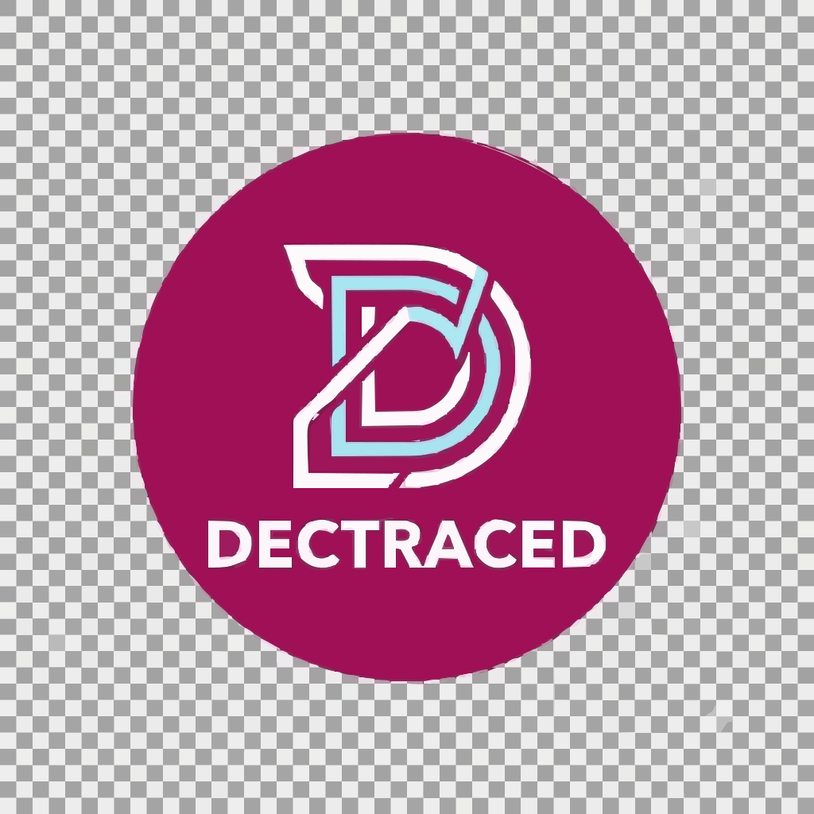

+++
title = "Hoem Paeg"
[extra]
no_header = true
+++

<div class="container-fill">
  


  <div class="buttons centered big">
    <a class="suggested" href="/demo/">Demo →</a>
    <a href="https://codeberg.org/daudix/ametrine">Repository →</a>
  </div>
  
  [Ametrine](https://en.wikipedia.org/wiki/Ametrine) is a "one of a kind" [Zola](https://www.getzola.org) theme made specifically for personal websites and blogs. It provides good defaults and easy configuration, while being somewhat flexible on demand. Its design is unique and made with great care and attention to details, it changes from time to time, and the development pace is rather rapid.
</div>

> [!CAUTION]
> Ametrine is currently in the pre-alpha state and **_SHOULD NOT_** be used in production, it is not ready yet. Version 0.1.0 is on its way and should be released sometime soon, along with a migration guide from [Duckquill](https://duckquill.daudix.one). See [v0.1.0 To-do](https://codeberg.org/daudix/ametrine/issues/3).

> [!NOTE]
> Ametrine **only targets the latest Zola version** available at a given moment, backwards compatibility might be absent, and issues regarding it will be dismissed. This is to keep Ametrine's code easier to maintain (it's already hard to maintain as is).


Some of Ametrine's features:

- Handwritten CSS (Sass); no Tailwind, React, or anything like that.
- No essential JavaScript; pop-ups, sidebars, and such will work just fine without it.
- Relatively lightweight, weights under 512kB.
- Uses modern CSS.
- Includes Monokai Pro theme for syntax highlighting out of the box.
- Will make you regret using this theme.

## What Is This Again

This is a theme for the [Zola](https://www.getzola.org) static site generator; thingy that converts [Markdown](https://www.markdownguide.org) files (which is used by Reddit, Tumblr, Discord, any many others) into a fully functional websites. Zola cannot build websites without a set of templates and styles, and this theme is exactly that. Ametrine also provides some custom functionality that is not present in Zola, such as Mastodon-powered comments, various useful shortcodes for simplifying various tasks, and more.

You can learn more about Zola and its themes at <https://www.getzola.org>.

## Installation

If you have Git set up in your project, add Ametrine as a submodule:

```bash
git submodule init
git submodule add https://codeberg.org/daudix/ametrine.git themes/ametrine
```

> [!IMPORTANT]
> It is highly recommended to switch from the `main` branch to the latest release:
>
> ```bash
> cd themes/ametrine
> git checkout tags/v0.1.0 # There is currently no tagged release
> ```

> [!NOTE]
> If you build your site with a CI, you can reduce the time needed to clone the repo (theoretically) by making Ametrine submodule "shallow":
>
> ```bash
> git config -f .gitmodules submodule.themes/ametrine.shallow true
> ```

Then, enable Ametrine in your `config.toml`:

```toml
theme = "ametrine"
```

To update Ametrine, simply switch to a new tag:

> [!IMPORTANT]
> Check the changelog for all versions after the one you are using; there may be breaking changes that require manual involvement.

```bash
git submodule update --remote --merge
cd themes/ametrine
git checkout tags/v0.1.0
```

> [!NOTE]
> If Zola returns an error that looks something like this:
>
> ```
> Error: Failed to serve the site
> Error: Failed to render page '/home/rd/Projects/awsum-website/content/reasons-why-i-m-cool/index.md'
> Error: Reason: Failed to render 'page.html': error while rendering macro `macros::icon` (error happened in a parent template)
> Error: Reason: Filter call 'urlencode' failed
> Error: Reason: Filter `urlencode` was called on an incorrect value: got `null` but expected a String
> ```
>
> Worry not, it can be fixed by running the following command:
>
> ```bash
> git submodule update --init --recursive
> ```
>
> This happens because Ametrine itself utilises a Git submodule that is required for it to function: [ametrine-icons](https://codeberg.org/daudix/ametrine-icons), which contains [phosphor-icons](https://github.com/phosphor-icons/core) and [simple-icons](https://github.com/simple-icons/simple-icons).

## Development

Working on Ametrine and your (nick)name isn't daudix? That's awesome! You might know that Ametrine requires a Last.fm API key, setting which each time can get tiresome, for this reason I have threw together a tiny script---`dev.sh`---that loads contents of `.env` file and runs Zola Flatpak with any arguments you might want to specify.

For ease of use on your own site, you can symlink it in place:

```bash
ln --symbolic themes/ametrine/dev.sh dev.sh
```


rd@lappy ~/Projects/awsum-website (main)> ./dev.sh serve --drafts --open
   _             _       _          
  /_\  _ __  ___| |_ _ _(_)_ _  ___ 
 / _ \| '  \/ -_)  _| '_| | ' \/ -_)
/_/ \_\_|_|_\___|\__|_| |_|_||_\___|
                                    
Building site...
-> Creating 16 pages (2 orphan) and 3 sections
Done in 6.5s.

Listening for changes in /home/rd/Projects/awsum-website/{config.toml,content,sass,static,templates}
Press Ctrl+C to stop

Web server is available at http://127.0.0.1:1111 (bound to 127.0.0.1:1111)


When working offline you can set `AMETRINE_OFFLINE` environment variable to `1`, which will skip all remote requests, if any. Keep in mind that it's a very dirty workaround for being able to build Ametrine at all while being offline, not something you should rely on normally.

## Why It Looks the Way It Does

Personally, I'm sick of flat, sterile, dead UIs all over the place, and I've always liked skeuomorphism because it's fun, alive, and pleasant to look at. While it's not very feasible to make things look overly realistic, some edge highlights, nice shadows, and a vibrant palette make a big difference. The design system that Ametrine uses is made of slightly frosted colored acrylic, everything is rounded, but the edges are not so rounded, so the edge highlight is rather thin, you can think of it as Lego bricks, fun and nice to touch. The animations are very bouncy to raise the fun level even higher. Still, the balance between fun and not being annoying is maintained. Did I succeed with this premise? I don't know, you tell me :P

## To-Do

As of right now, Ametrine is not ready to be used in production and is in active development, here's a roadmap of features that need to be implemented, issues to be fixed, and things to be rewritten before the initial release: <https://codeberg.org/daudix/ametrine/milestone/12016>. <small>(asking me "v0.1 when" won't make the process any faster, I want to release it <abbr title="as soon as possible">ASAP</abbr> just like you do)</small>


<style>
  #logo {
    width: min(calc(var(--content-width) / 2), 100%);
  }

  #logo:hover {
    transform: var(--hover) rotate(-5deg);
  }
</style>